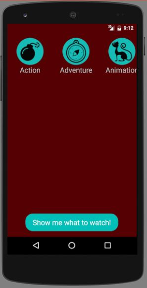

# What To Watch
An android app which shows suggestion for movies.
This android application was made during my semester at Newcastle University for the Mobile Development module.

# Features
This app allows you to have a selection of movies according to the genre you have chosen. Then it displays a selection of ten movies, and you can have details about it like actors, overview and synopsis

# Technologies used
* Android Studio
* [TMDb](https://www.themoviedb.org/documentation/api) api and a [java wrapper](https://github.com/holgerbrandl/themoviedbapi)
* Adobe Illustrator for graphics

# Captures

